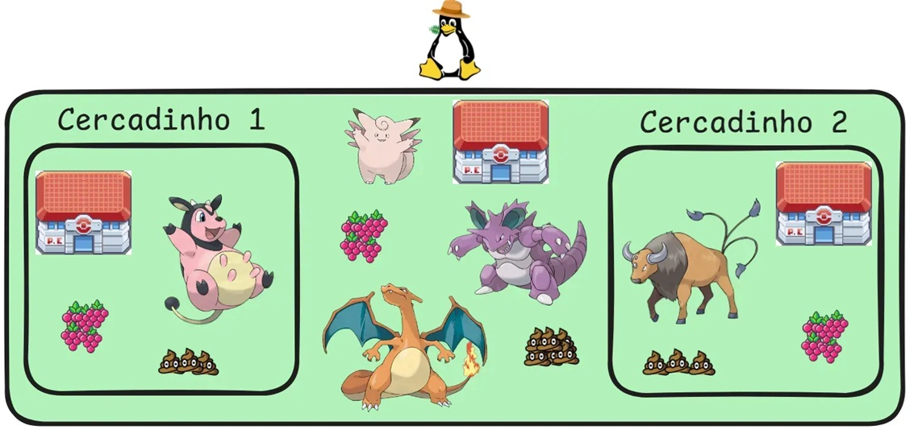
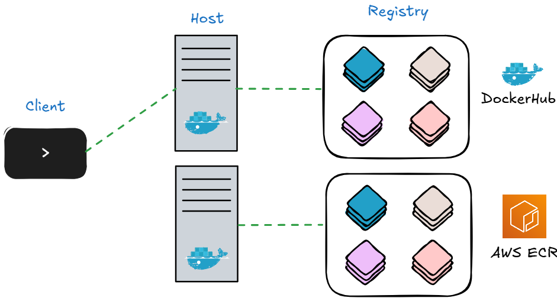
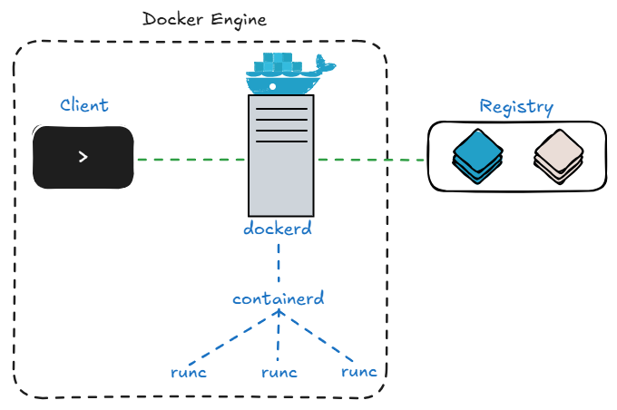
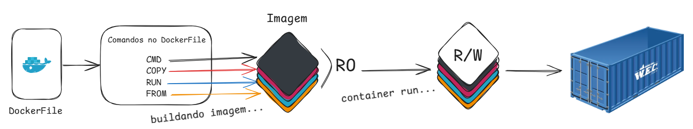

## O que é o container?
Antes de entendermos o que é o Docker, precisamos dar um passo para trás e entender o que é um container. Um container é uma forma de isolar recursos para um determinado fim. 

Vamos colocar isso em um contexto Pokemon para que possa ficar mais fácil o entendimento, imagine a fazenda Linus (podemos entender como um servidor/máquina), o dono dela é o “Pinguim Linux Fazendeiro”, que possui como funcionários a Clefable, o Nidoking e o Charizard, são os PokeFuncionários (também conhecidos como Módulos do Linux), e cada funcionário possui uma função específica ao construir os cercadinhos (containers).



A Miltank e o Taurus estão dentro dos cercadinhos (que você já sabe que é um container). Essa cerca impede que os Pokemons que estão dentro visualizem o mundo externo, na verdade, eles acreditam que o mundo inteiro é o cercadinho. A Miltank e o Taurus possuem seus próprios Centros Pokemon, suas berries e suas sujeiras, estes podem ser entendidos como os recursos que citamos acima quando falamos o que é isolado. Porém, é super importante notar que tanto os cercadinhos compartilham o mesmo terreno da Fazendo Linus.

Se tivéssemos escolhido colocar a Miltank e o Taurus em uma máquina virtual ao invés de um container, teríamos que construir uma outra Fazenda Linus dentro de uma Fazenda Linus. Com todos os PokeFuncionários, com outro Pinguim Linux Fazendeiro. E quando colocamos no container, damos à Miltank e o Taurus apenas o que eles realmente precisam para continuar fazendo suas funções.

Vamos conhecer um pouco dos PokeFuncionários da fazenda Linus?

- `C`lefable (em referência ao `Cgroups`): Responsável pelo isolamento de CPU e Memória, podemos pensar que ela está pegando do Centro Pokemon (que possui 20 máquinas) da Fazendo Linus, 1 máquina para cada cercadinho.
- `N`idoking (em referência ao `Namespaces`): Responsável pelo isolamento de Filesystem, Processos, Network, Usuários…
- `Ch`arizard (em referência ao `Chroot`): Responsável por trancar a cerca, por prender a aplicação e fazer com que ele pense que a sua cerca é toda a fazenda.

Mas e o Docker nisso tudo? Onde ele se encontra? Pense nele como um planejador, um facilitador desse processo de construção de cercas, que convoca os PokeFuncionários, que organiza a construção de forma bem simples e segura. Essa simplicidade que com que o Docker se popularizasse. O Docker hoje roda em Linux, MacOs e Windows, mas não possui a mesma performance e estabilidade quando rodando em Linux.

Sabendo o que são containers e o que faz o Docker, podemos seguir para os capítulos abaixo, se não entendeu ainda direito, continue lendo os próximos capítulos que pode clarear melhor as ideias.

## Instalação do Docker Engine
Fica de lição de casa instalar o Docker Engine na sua máquina:
https://docs.docker.com/engine/install/

Teve problemas? Coloca no Google, isso é parte da atividade também.

Instalado? Escreva no terminal: `docker --version`

Se apareceu a versão do seu docker instalado, faz agora um favorzão pra mim? Joga no terminal isso aqui:

```sh 
docker container run hello-world
```

Diz pra gente o que apareceu... Valeu!

**----- Não passe daqui se antes de rodar o comando ein !!! -----**

## Client, Host e Registry
Se deu tudo certo, você rodou o container `hello-world`, você recebeu uma mensagem de... "Hello World" através de um container que o Docker trouxe para gente. Mas peraí, de onde esse container surgiu? Como que funcionou toda essa mágica do Docker?

Essa etapa agora é justamente para tentar explicar isso. Para isso, vamos apresentar alguns novos componentes, que são:




O **Client** é a interface de linha de comando (CLI), é o meio o qual os usuários podem interagir com o Host. A partir do Client é possível se comunicar com outros Hosts.
A ação é executada pelo **Host**, que é o componente que executa os containers, é a máquina em que está rodando o processo do Docker (Docker Daemon), ele quem armazenar/baixar imagens, criar containers, etc.
O **Registry** é para onde vamos enviar e baixar nossas imagens, temos serviços como o DockerHub que vem padrão que é gratuito e público, e temos serviços privados.

Quando rodamos o `docker run hello-world`, aconteceu o seguinte: Passamos o comando no Client que enviou para o Host, este verificou se existia a imagem do container que você pediu, se não existia no host, ele solicitou a imagem no DockerHub, que depois de baixado e salvo, ele executou a imagem gerando o container.

E vamos aproveitar já esse espaço para aprofundar um pouco mais sobre o Docker Engine como um todo, que foi o que você instalou na sua máquina. Lembra quando falamos lá na fazenda Linus que o Docker era um facilitador, um organizador? Pois bem, por que o Docker não é a runtime, ele não vai lá e roda o container diretamente.



Docker Engine é a combinação do Docker Daemon, Docker Engine Rest API e Docker CLI.

Mas para entender como o Docker funciona, como ele gerencia os containers de fato, precisamos conhecer 3 componentes:
- dockerd: Processo que gerencia o Docker como um todo. Quem é recebe as solicitações do Client, cuida de aspectos de alto nível (rede, criação de volumes, manipulação de imagens, configurações de containers) e delega a execução de containers e o gerenciamento de imagens para o containerd.
- containerd: É um runtime de container de alto nível, que gerencia o ciclo de vida, que coordena a execução e o gerenciamento de containers, imagens e volumes. E utiliza o runct para executar os containers. Ele também lida com o download, armazenamento e manipulação de imagens de containers, gerencia o início, pausa, parada e remoção de containers, gerencia também volumes de armazenamento para containers.
- runc: É o runtime de containers de baixo nível, é o runtime que interage com o kernel do Linux, lembra dos PokeFuncionários? É o runc que conversa diretamente com eles para construir as cercas... ops, os containers.

## O que são imagens de containers?
Acredito que depois de todo esse contéudo que vimos, está faltando falar de Imagens de containers, você pode estar se perguntando se é uma foto de um container, um .png, .jpeg? E não, e sim também... enfim... você vai entender.

Em resumo: *"Uma imagem são camadas, que juntas foram um container parado."*

Uma imagem é construída a partir de um **Dockerfile** (arquivo de texto que passamos instruções para buildar uma imagem de container), cada instrução passada ao Dockerfile cria uma camada para imagem. Esses comandos nós vamos ver depois, então sem estresse agora.



Uma imagem é completamente Read-Only, porém, quando ele é executada (quando vamos criar um container) é adicionada uma nova camada no topo, esta é Read-Write. Essa camada é única por instância do container, permitindo que ele escreva e modifique arquivos enquanto está em execução, não afetando a imagem base (camadas read-only).
