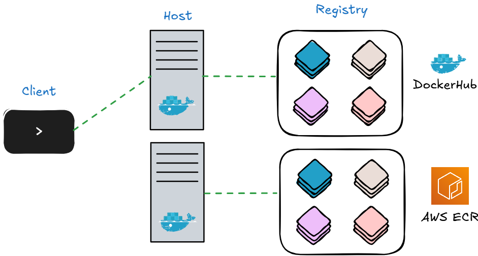

## O que é o container?
Antes de entendermos o que é o Docker, precisamos dar um passo para trás e entender o que é um container. Um container é uma forma de isolar recursos para um determinado fim. 

Vamos colocar isso em um contexto Pokemon para que possa ficar mais fácil o entendimento, imagine a fazenda Linus (podemos entender como um servidor/máquina), o dono dela é o “Pinguim Linux Fazendeiro”, que possui como funcionários a Clefable, o Nidoking e o Charizard, são os PokeFuncionários (também conhecidos como Módulos do Linux), e cada funcionário possui uma função específica ao construir os cercadinhos (containers).


A Miltank e o Taurus estão dentro dos cercadinhos (que você já sabe que é um container). Essa cerca impede que os Pokemons que estão dentro visualizem o mundo externo, na verdade, eles acreditam que o mundo inteiro é o cercadinho. A Miltank e o Taurus possuem seus próprios Centros Pokemon, suas berries e suas sujeiras, estes podem ser entendidos como os recursos que citamos acima quando falamos o que é isolado. Porém, é super importante notar que tanto os cercadinhos compartilham o mesmo terreno da Fazendo Linus.

Se tivéssemos escolhido colocar a Miltank e o Taurus em uma máquina virtual ao invés de um container, teríamos que construir uma outra Fazenda Linus dentro de uma Fazenda Linus. Com todos os PokeFuncionários, com outro Pinguim Linux Fazendeiro. E quando colocamos no container, damos à Miltank e o Taurus apenas o que eles realmente precisam para continuar fazendo suas funções.

Vamos conhecer um pouco dos PokeFuncionários da fazenda Linus?

- `C`lefable (em referência ao `Cgroups`): Responsável pelo isolamento de CPU e Memória, podemos pensar que ela está pegando do Centro Pokemon (que possui 20 máquinas) da Fazendo Linus, 1 máquina para cada cercadinho.
- `N`idoking (em referência ao `Namespaces`): Responsável pelo isolamento de Filesystem, Processos, Network, Usuários…
- `Ch`arizard (em referência ao `Chroot`): Responsável por trancar a cerca, por prender a aplicação e fazer com que ele pense que a sua cerca é toda a fazenda.

Mas e o Docker nisso tudo? Onde ele se encontra? Pense nele como um planejador, um facilitador desse processo de construção de cercas, que convoca os PokeFuncionários, que organiza a construção de forma bem simples e segura. Essa simplicidade que com que o Docker se popularizasse. O Docker hoje roda em Linux, MacOs e Windows, mas não possui a mesma performance e estabilidade quando rodando em Linux.

Sabendo o que são containers e o que faz o Docker, podemos seguir para os capítulos abaixo, se não entendeu ainda direito, continue lendo os próximos capítulos que pode clarear melhor as ideias.

## Instalação do Docker Engine
Fica de lição de casa instalar o Docker Engine na sua máquina:
https://docs.docker.com/engine/install/

Teve problemas? Coloca no Google, isso é parte da atividade também.

Instalado? Escreva no terminal: `docker --version`

Se apareceu a versão do seu docker instalado, faz agora um favorzão pra mim? Joga no terminal isso aqui:

```sh 
docker container run hello-world
```

Diz pra gente o que apareceu... Valeu!

**----- Não passe daqui se antes de rodar o comando ein !!! -----**

## Client, Host e Registry
Se deu tudo certo, você rodou o container `hello-world`, você recebeu uma mensagem de... "Hello World" através de um container que o Docker trouxe para gente. Mas peraí, de onde esse container surgiu? Como que funcionou toda essa mágica do Docker?

Essa etapa agora é justamente para tentar explicar isso. Para isso, vamos apresentar alguns novos componentes, que são:




O **Client** é a interface de linha de comando (CLI), é o meio o qual os usuários podem interagir com o Host. A partir do Client é possível se comunicar com outros Hosts.
A ação é executada pelo **Host**, que é o componente que executa os containers, é a máquina em que está rodando o processo do Docker (Docker Daemon), ele quem armazenar/baixar imagens, criar containers, etc.
O **Registry** é para onde vamos enviar e baixar nossas imagens, temos serviços como o DockerHub que vem padrão que é gratuito e público, e temos serviços privados.

Quando rodamos o `docker run hello-world`, aconteceu o seguinte: Passamos o comando no Client que enviou para o Host, este verificou se existia a imagem do container que você pediu, se não existia no host, ele solicitou a imagem no DockerHub, que depois de baixado e salvo, ele executou a imagem gerando o container.

E vamos aproveitar já esse espaço para falar sobre o Docker Engine, que foi o que você instalou na sua máquina. Lembra quando falamos lá na fazenda Linus que o Docker era um facilitador, um organizador? Pois bem, por que o Docker não é a runtime, ele não vai lá e roda o container diretamente.


Todo o ciclo de vida do container é feito pelo containerd (daemon), que funciona como um intermediário entre o Docker Engine e o runc.

O containerd é responsável por criar, iniciar, parar e monitor containers, também por fazer download de imagens e construir containers a partir delas. Também responsável por chamar o runc para realizar a execução real de containers.

É o runtime que interage com o kernel do Linux, lembra dos PokeFuncionários? É o runc que conversa diretamente com eles para construir as cercas, os containers.

Acredito que agora ficou tudo mais claro, já sabemos quem são os componentes do Docker e como ele funciona. Vamos agora ver alguns comandos que podemos passar no `Docker Client`.

## Criando e Gerenciando os primeiros containers
Antes de seguir nesse próximo tópico aqui, vou pedir mais um favor para você caro amigo. Digite o seguinte no terminal:
`docker --help`
 
 
 comandos para gerenciar containers

- docker container ls
- docker image ls 
- ls 
- ls -a


